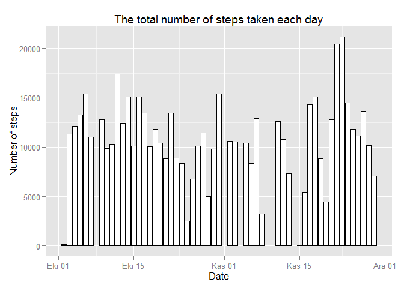
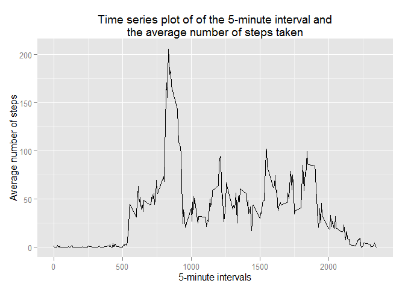
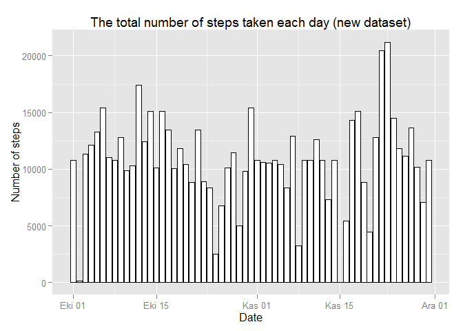

# Reproducible Research: Peer Assessment 1

Setting working directory:


```r
setwd("C:/Users/Dell/Desktop/R/Reproducible/Course project 1")
```

## Loading and preprocessing the data


```r
activity <- read.csv("activity.csv")
activity$date <- as.Date(activity$date, format="%Y-%m-%d")
```

## What is mean total number of steps taken per day?

Making a histogram of the total number of steps taken each day (the missing values in the dataset are ignored):

1) Loading ggplot2


```r
library(ggplot2)
```

2) Aggregating number of steps taken each day


```r
aggregatedSteps <- aggregate(steps ~ date, data = activity, sum, na.rm=TRUE, na.action = na.omit)
```

3) Making a histogram


```r
ggplot(aggregatedSteps, aes(x = date, y = steps)) +
  geom_histogram(binwidth=60, colour="black", fill = "white", stat="identity") +
  labs(x = "Date", y = "Number of steps", title = "The total number of steps taken each day")
```

 

Calculating and reporting the mean and median total number of steps taken per day


```r
meanSteps <- mean(aggregatedSteps$steps, na.rm=TRUE)
medianSteps <- median(aggregatedSteps$steps)
```

- Mean: **10766.19**
- Median: **10765**

## What is the average daily activity pattern?

1. Making a time series plot (i.e. type = "l") of the 5-minute interval (x-axis) and the average number of steps taken, averaged across all days (y-axis)


```r
aggregatedIntervals <- aggregate(steps ~ interval, data = activity, mean, na.rm=TRUE)
ggplot(aggregatedIntervals, aes(x = interval, y = steps)) +
  geom_line() + 
  labs(x = "5-minute intervals", y = "Average number of steps", title = "Time series plot of of the 5-minute interval and\nthe average number of steps taken")
```

 

2. Which 5-minute interval, on average across all the days in the dataset, contains the maximum number of steps?


```r
maxInterval <- aggregatedIntervals[which(aggregatedIntervals$steps == max(aggregatedIntervals$steps)),1]
```

- The 5-minute interval that contains the maximum of steps, on average across all days: 835

## Imputing missing values

1. Calculate and report the total number of missing values in the dataset (i.e. the total number of rows with NAs)


```r
numberNA <- nrow(activity[is.na(activity$steps) == TRUE,])
```

- The total number of missing values in the dataset: **2304**

2. Filling in all of the missing values in the dataset with the mean for that 5-minute interval:


```r
stepsNew <- NULL
for(i in 1:nrow(activity)){
  if(is.na(activity[i,1]) == TRUE){
  a <- aggregatedIntervals[which(aggregatedIntervals$interval == activity[i,3]),2]
  } else {
  a <- activity[i,1]
  }
  stepsNew <- c(stepsNew, a)
}
```

3. Create a new dataset that is equal to the original dataset but with the missing data filled in.


```r
newActivity <- activity
newActivity$steps <- stepsNew
```

4. Make a histogram of the total number of steps taken each day


```r
aggregatedStepsNew <- aggregate(steps ~ date, data = newActivity, sum, na.rm=TRUE)
ggplot(aggregatedStepsNew, aes(x = date, y = steps)) +
  geom_histogram(binwidth=60, colour="black", fill = "white", stat="identity") +
  labs(x = "Date", y = "Number of steps", title = "The total number of steps taken each day (new dataset)")
```

 

Calculate and report the mean and median total number of steps taken per day:


```r
meanStepsNew <- mean(aggregatedStepsNew$steps)
medianStepsNew <- median(aggregatedStepsNew$steps)
```

- Mean in the new dataset: **10766.19**
- Median in the new dataset: **10766.19**

The value of the median in the new dataset differs from the median value in the original dataset with missing values. While the values of mean are equal for both datasets.

## Are there differences in activity patterns between weekdays and weekends?

1. Create a new factor variable in the dataset with two levels -- "weekday" and "weekend" indicating whether a given date is a weekday or weekend day.


```r
Sys.setlocale("LC_TIME", "English")
```

```
## [1] "English_United States.1252"
```

```r
newActivity$daytype <- weekdays(newActivity$date)
newActivity$daytype <- ifelse(newActivity$daytype %in% c("Saturday", "Sunday"), 'weekend', 'weekday')
newActivity$daytype <- as.factor(newActivity$daytype)
```

2. Make a panel plot containing a time series plot (i.e. type = "l") of the 5-minute interval (x-axis) and the average number of steps taken, averaged across all weekday days or weekend days (y-axis). 


```r
library(lattice)
daytypeMean <- aggregate(newActivity$steps, by=list(newActivity$daytype, newActivity$interval), mean)
names(daytypeMean) <- c("daytype", "interval", "mean")
xyplot(mean ~ interval | daytype, daytypeMean, 
       type="l", 
       lwd=1, 
       xlab="Interval", 
       ylab="Number of steps", 
       layout=c(1,2))
```

 

